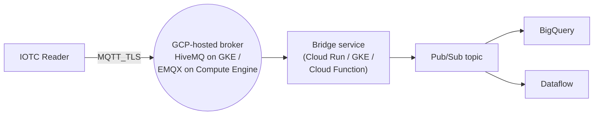

> 📙 **HOW-TO** · **Audience:** Solution Builder · **Time:** ~60 min

:::info
Google Cloud IoT Core was deprecated by Google in 2023. This guide targets the successor pattern: GCP-hosted Pub/Sub via an MQTT bridge or a customer-hosted MQTT broker on GCP infrastructure. If you are building on GCP, evaluate [Custom MQTT Broker](/fleet/cloud-integration/custom-broker) using HiveMQ on GKE or EMQX on Compute Engine.
:::

This guide shows you how to connect a handheld reader to a GCP-hosted MQTT broker and route tag data into Pub/Sub for downstream processing.

### Prerequisites

A GCP project, a GKE cluster (or Compute Engine instance) hosting an MQTT broker, a Pub/Sub topic for tag data.

### Step 1: Deploy the broker

Deploy HiveMQ, EMQX, or Mosquitto on GCP per the vendor's instructions. Configure TLS, expose port 8883 publicly, and set up an authentication backend (vault-integrated or static credentials).

### Step 2: Install certificates on the reader

Per [Certificate management](/infrastructure/security/certificate-management), install the broker's CA certificate and (if using mutual TLS) the client certificate.

### Step 3: Configure the reader's endpoint

```json
{
  "command": "config_endpoint",
  "command_id": "gcp-1",
  "data": {
    "interface": "data",
    "host": "<broker-hostname>.example.com",
    "port": 8883,
    "tls": true,
    "username": "<broker-user>",
    "password": "<broker-password>",
    "ca_alias": "gcp-broker-ca"
  }
}
```

### Step 4: Bridge to Pub/Sub

Deploy a bridge service (a Cloud Run service, a GKE pod, or a Cloud Function with Eventarc) that subscribes to the MQTT broker's tag-data topics and publishes to a Pub/Sub topic. Downstream consumers (Dataflow, BigQuery streaming inserts, Cloud Functions) consume from Pub/Sub.

### Step 5: Verify

Watch Pub/Sub topic metrics — message rate should match the reader's tag-emission rate.



**Related:** 📘 [Integration Patterns](/fleet/cloud-integration/patterns) · 📙 [Custom MQTT Broker](/fleet/cloud-integration/custom-broker) · 📙 [TLS Setup](/infrastructure/security/tls-setup)
