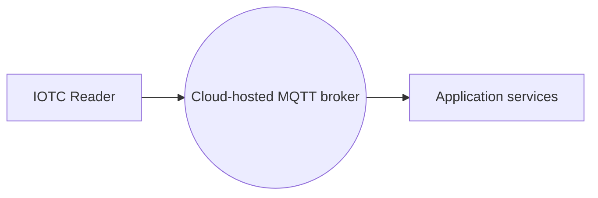
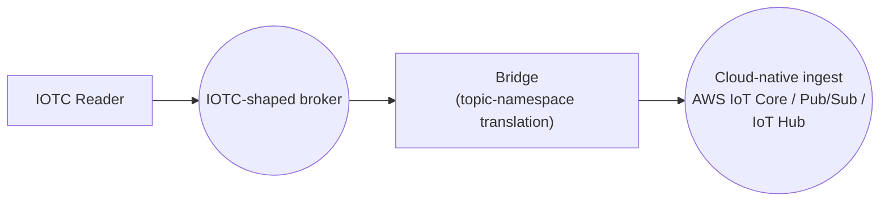
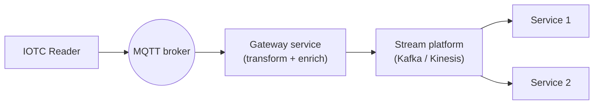

> 📘 **EXPLANATION** · **Audience:** Solution Builder · **Read time:** ~5 min

Three patterns dominate cloud-backed IOTC deployments. The choice is structural: each has different latency, complexity, and scale characteristics.

### Direct integration

Readers point their MQTT endpoints directly at a cloud-platform broker. AWS IoT Core, Azure IoT Hub MQTT, GCP, or HiveMQ Cloud. The cloud broker is the only broker in the path.

**When:** simple deployments, fleets where Zebra-hosted broker is unnecessary.

### Bridge pattern

A small MQTT bridge translates between IOTC's topic namespace and the cloud platform's preferred topic structure. The reader publishes to its Zebra-namespace topic; the bridge republishes to a cloud-namespace topic; the cloud platform consumes natively.

**When:** the cloud platform has a specific topic convention you need to honour (e.g., AWS IoT Core's `$aws/things/...`); useful for retrofitting existing pipelines.

### Gateway pattern

An application service subscribes to IOTC events from the broker, transforms or enriches them, and pushes to the cloud platform's native ingest API (often non-MQTT).

**When:** the cloud platform's ingest is not MQTT-shaped, or you need to do significant transformation before persistence.

### Choosing

| Factor | Direct | Bridge | Gateway |
|---|---|---|---|
| Latency | Lowest | Low | Higher |
| Operational complexity | Low | Medium | High |
| Cost | Low | Medium | Highest |
| Flexibility | Low | Medium | Highest |
| Cloud lock-in | Highest | Medium | Lowest |

Start with **direct** for simplicity. Move to **bridge** or **gateway** when a specific cloud capability or topology constraint demands it.

**Related:** 📙 [AWS IoT Core](/fleet/cloud-integration/aws) · 📙 [Azure IoT Hub](/fleet/cloud-integration/azure) · 📙 [GCP](/fleet/cloud-integration/gcp) · 📙 [Custom Broker](/fleet/cloud-integration/custom-broker) · 📘 [Multi-Endpoint Architectures](/infrastructure/endpoints/multi-endpoint)
