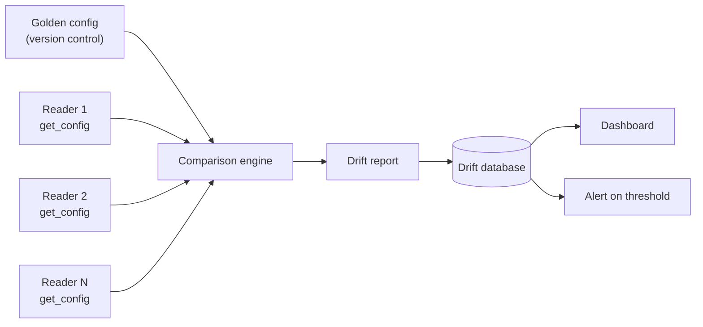

> 📙 **HOW-TO** · Audience: Solution Builder · Time: ~30 min

This guide shows you how to detect and remediate configuration drift across a reader fleet.

### Store a golden configuration baseline

Maintain the desired configuration in version control. The golden config is the authoritative declaration of "what every reader should look like."

### Diff [`get_config`](https://aa5123.github.io/RFID-40-90-handled-reader-api-reference-documentatiion/#op-get-config) output against the baseline

For each reader periodically (daily or hourly):

```python
def check_drift(serial):
    actual = get_config(serial)
    baseline = load_golden_config()
    diff = compute_diff(actual, baseline)
    if diff:
        log_drift(serial, diff)
        if should_remediate(diff):
            remediate(serial, diff)
```

### Decide whether to remediate

Not every difference matters. A reader's connection quality fields drift naturally; a Wi-Fi profile difference is significant. Categorize fields:

- **Ignore drift** in: runtime telemetry fields (battery, temperature, connection state)
- **Alert on drift** in: certificate aliases, MDM endpoint
- **Auto-remediate drift** in: event-reporting config, default operating mode

### Auto-remediate

```python
def remediate(serial, diff):
    patch = build_patch_from_diff(diff)
    # set_config payload-shape per canonical schema:
    # configData accepts wifiConfig and/or epConfig sub-objects.
    publish_command(serial, {
        "command": "set_config",
        "requestId": f"drift-{serial}",
        "configData": patch  # already shaped as {wifiConfig?, epConfig?, applyAfterReboot?}
    })
```

### Fleet-wide compliance monitoring

Maintain a per-reader drift score over time. Dashboards highlight readers that drift repeatedly (indicating misconfiguration source) and readers whose drift was successfully remediated.



**Related:** 📙 [Read Config](/fleet/management/read-config) · 📙 [Apply Bulk Config](/fleet/management/apply-config) · 📙 [Automation](/fleet/provisioning/automation)
