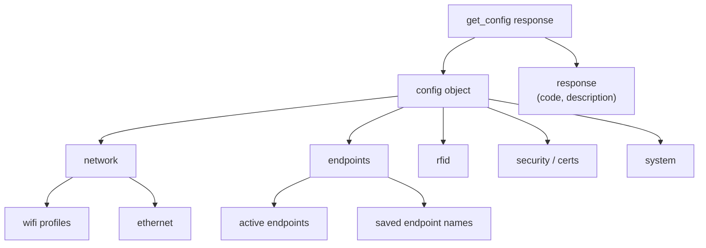

> 📙 **HOW-TO** · Audience: Fleet Operator · Time: ~5 min

This guide shows you how to read the full configuration document from a handheld reader.

### Issue the command

```json
{"command": "get_config", "command_id": "gc-1"}
```

### Parse the response

The response is a nested JSON document. Top-level sections correspond to the individual `get_*` endpoint domains:

```json
{
  "response": "get_config",
  "command_id": "gc-1",
  "data": {
    "network": { ... },
    "security": { ... },
    "endpoints": { ... },
    "rfid": { ... },
    "events": { ... },
    "mdm": { ... }
  }
}
```

### Section correspondence

| Config section | Corresponds to individual endpoint |
|---|---|
| `network` | [`get_wifi`](https://aa5123.github.io/RFID-40-90-handled-reader-api-reference-documentatiion/#op-get-wifi), [`get_eth`](https://aa5123.github.io/RFID-40-90-handled-reader-api-reference-documentatiion/#op-get-eth) |
| `security` | [`get_installed_certificate`](https://aa5123.github.io/RFID-40-90-handled-reader-api-reference-documentatiion/#op-get-installed-certificate) |
| `endpoints` | [`get_endpoint_config`](https://aa5123.github.io/RFID-40-90-handled-reader-api-reference-documentatiion/#op-get-endpoint-config) |
| `rfid` | [`get_operating_mode`](https://aa5123.github.io/RFID-40-90-handled-reader-api-reference-documentatiion/#op-get-operating-mode), [`get_post_filter`](https://aa5123.github.io/RFID-40-90-handled-reader-api-reference-documentatiion/#op-get-post-filter) |
| `events` | (corresponds to [`config_events`](https://aa5123.github.io/RFID-40-90-handled-reader-api-reference-documentatiion/#op-config-events) settings) |

For the complete schema, see [Config schema](/reference/appendices/config-schema).



**Related:** 📕 [get_config](https://aa5123.github.io/RFID-40-90-handled-reader-api-reference-documentatiion/#op-get-config) · 📕 [Config Schema](/reference/appendices/config-schema) · 📙 [Apply Bulk Config](/fleet/management/apply-config)
