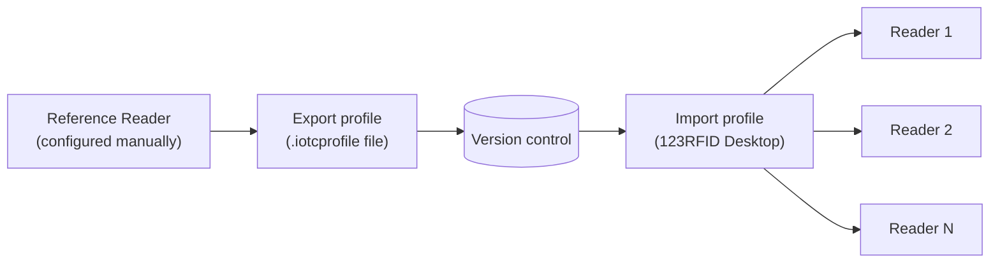

> 📙 **HOW-TO** · Audience: Fleet Operator · Time: ~30 min for 10 readers

This guide shows you how to provision multiple handheld readers using 123RFID Desktop profiles.

### Create a configuration profile

1. Open 123RFID Desktop with one reference reader connected via USB.
2. Configure the reference reader fully (region, Wi-Fi, MDM endpoint).
3. Choose **File to Export Profile** and save the `.iotcprofile` file.

### Apply to a batch of readers

For each reader in the batch:

1. Connect via USB.
2. In 123RFID Desktop, choose **File to Import Profile** and select the saved profile.
3. Click **Apply to Device**.
4. Wait for confirmation; disconnect.

A practiced operator can process ~1 reader per minute.

### Export/import profiles

Profiles are portable: the same `.iotcprofile` file works across compatible firmware versions. Store profiles in version control alongside other deployment artefacts.

### Verify post-apply

After provisioning, power on each reader and pair with its host device. The reader should connect to MQTT within seconds. Subscribe to `mqttConnEVT` with a wildcard to confirm all batch members are online.

**Related:** 📘 [Provisioning Models](/fleet/provisioning/models) · 📗 [Phase 2: Single-Reader Bootstrap with 123RFID Desktop](/getting-started/quick-start/step-2-discover)
