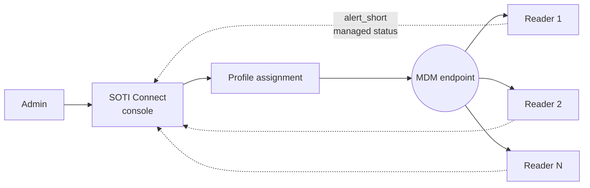

> 📙 **HOW-TO** · Audience: Fleet Operator · Time: ~45 min

This guide shows you how to set up zero-touch provisioning for handheld readers using SOTI Connect.

### Prerequisites

A configured SOTI Connect instance with MQTT broker integration, administrator credentials, and the IOTC MDM connector enabled in SOTI Connect.

### Step 1: Configure the MDM endpoint on readers

During 123RFID Desktop bootstrap ([Phase 2 of the Quick Start](/quick-start/phase-2/direct)), set the MDM endpoint URL to your SOTI Connect MQTT-broker hostname and credentials.

### Step 2: Enroll devices in SOTI Connect

In SOTI Connect's admin console, navigate to **Devices to Add Device**. Add each reader by serial number, or use the bulk-import feature with a CSV. SOTI Connect creates a device record but does not yet manage configuration.

### Step 3: Create a configuration profile

In SOTI Connect, **Profiles to New IOTC Profile**. Define the runtime configuration: Wi-Fi profiles, endpoint configurations, event reporting, default operating mode. This is the "golden config" that will be pushed to enrolled devices.

### Step 4: Distribute the profile

Assign the profile to one or more device groups. SOTI Connect pushes the profile to each enrolled reader the next time the reader checks in.

### Step 5: Orchestrate firmware updates

Use SOTI Connect's update-orchestration feature to schedule firmware updates by group and time window. The MDM platform invokes [`set_os`](https://aa5123.github.io/RFID-40-90-handled-reader-api-reference-documentatiion/#op-set-os) on each target device per the schedule.

### Verify

Watch `alert_short` events on the MDM interface: a successfully managed reader emits a "managed" status alert. SOTI Connect's device-detail view shows the same.

**Related:** 📘 [Provisioning Models](/fleet/provisioning-models) · 📕 [MDM Interface](/reference/api-overview) · 📕 [alert_short](https://aa5123.github.io/RFID-40-90-handled-reader-api-reference-documentatiion/#tag-alert-short) · 📙 [Endpoint Configuration](/infrastructure/endpoints/configure)
