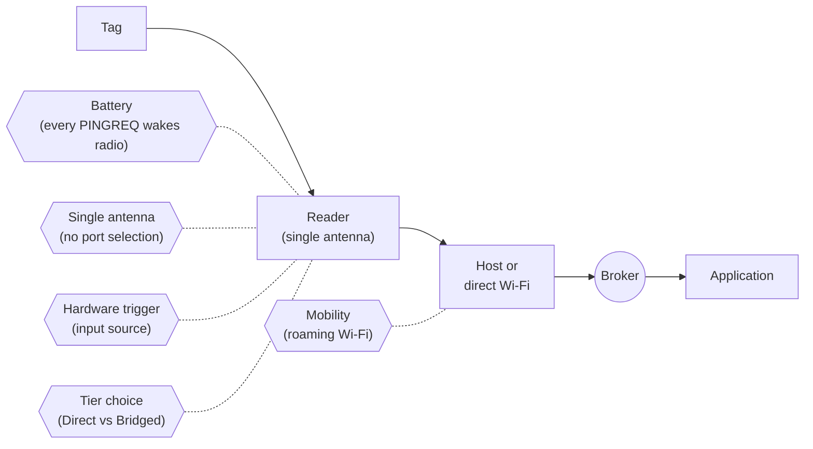

> 📘 **EXPLANATION** · **Audience:** Solution Builder · **Read time:** ~6 min

Five architectural facts make handheld IOTC different from fixed-reader IOTC. They are not edge cases. Every operational decision rests on them.

### Bluetooth dependency

The sled reaches the network only through its paired host device, over Bluetooth 5.0 LE. The BT link has its own failure modes (pairing churn, interference, range)separate from Wi-Fi and MQTT. A "disconnected reader" might be a Wi-Fi outage, an MQTT broker problem, or a Bluetooth drop. [Bluetooth Troubleshooting](/reference/troubleshooting/bluetooth) treats this as a first-class category.

### Battery is the primary constraint

Persistent MQTT connections, frequent heartbeats, high-throughput tag reads, all of these draw battery. A heartbeat at 5-second intervals consumes meaningfully more battery than one at 60-second intervals. An always-on inventory drains a fully-charged RFD90 in 4–6 hours. [Battery Monitoring](/observability/monitoring/battery) and [About Heartbeat Events](/observability/heartbeat) name the trade-offs.

### A single internal antenna

There is one antenna. There are no antenna ports to choose between, no cable losses to compensate, no per-port power settings. RF parameters (power, sensitivity, Q-value) apply to the single antenna for all reads. This simplifies the API significantly compared with fixed readers, but it also means range is fixed at hardware design time. The RFD90's longer range is a hardware property, not a configuration.

### The host device is the network gateway

The reader has no externally-visible IP address. The host device's network is the path to MQTT. This means: the host's Wi-Fi credentials matter (the reader uses them indirectly), the host's firewall posture matters, and the host's app lifecycle matters — when the OS suspends the host app, the reader's MQTT traffic suspends with it.

### The physical trigger is an input source

The sled has a hardware trigger button. Pulling it generates events that map to [`control_operation`](https://aa5123.github.io/RFID-40-90-handled-reader-api-reference-documentatiion/#op-control-operation) semantics — start, stop, or pulse-read depending on trigger mode. An application that subscribes only to [`control_operation`](https://aa5123.github.io/RFID-40-90-handled-reader-api-reference-documentatiion/#op-control-operation) responses will receive responses regardless of whether the trigger was the cause. [About Trigger-Based Operations](/rfid/operating-mode/trigger-composition) treats this fully.

### What this implies for the rest of this documentation

These constraints surface in Part III (network and security must work through the host), Part IV (operating modes are tuned to the single antenna), Part V (events focus on battery and BT state), and Part VI (provisioning at scale assumes MDM-managed host devices). They are not caveats footnoted on isolated pages; they are structural.

**Related:** 📘 [Network Architecture](/infrastructure/network/architecture) · 📙 [Bluetooth Pairing](/quick-start/prerequisites/bluetooth-pairing) · 📘 [Trigger Operations](/rfid/operating-mode/trigger-composition) · 📙 [Battery Monitoring](/observability/monitoring/battery)
