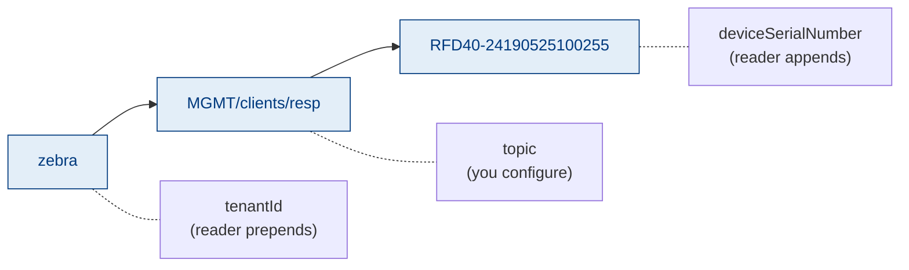
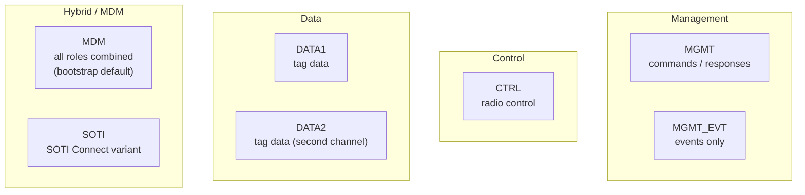

> 📘 **EXPLANATION** · Audience: All · Read time: ~5 min

An IOTC reader exposes its functionality through **endpoints** — named MQTT connections, each typed by role. There are seven endpoint types; a reader has at least one (the MDM endpoint, configured at bootstrap), and typically several more (configured remotely once the reader is online).

### The seven endpoint types

| `epType` | Role |
|---|---|
| `MGMT` | Dedicated management command and response channel |
| `MGMT_EVT` | Dedicated management events channel |
| `CTRL` | RFID control commands and responses |
| `DATA1` | Primary tag-data event stream |
| `DATA2` | Secondary tag-data event stream |
| `MDM` | Combined management commands + events for an MDM platform |
| `SOTI` | Specialised endpoint type for SOTI MobiControl MDM integration |

A reader can have multiple endpoints of different types simultaneously. The choice of which types to provision depends on whether the deployment needs traffic isolation (split MGMT from CTRL from DATA) or simplicity (a single MDM endpoint that combines management and events).

### The three-part topic template

All topics on an IOTC reader follow this structure:

```
<tenantId> / <topic> / <deviceSerialNumber>
```

The middle segment (`<topic>`)is **configured per endpoint** via the endpoint's `publishTopics` and `subscribeTopics` arrays. Common conventions used in source examples include `MGMT/clients/cmnd`, `MGMT/clients/resp`, `CTRL/clients/event`, `MGMT/clients/rfid`. The "clients" segment is a customary middle-of-topic convention, **not** a protocol-fixed element.

The reader **prepends `tenantId` and appends `deviceSerialNumber` automatically** at runtime. Never include them in the configured `topic` field.





### The MDM-endpoint-as-bootstrap pattern

The MDM endpoint is the **only** endpoint that can be configured without an MQTT connection. It is provisioned via the 123RFID Desktop application during reader onboarding. Once the reader is online via its MDM endpoint, all other endpoints (`MGMT`, `MGMT_EVT`, `CTRL`, `DATA1`, `DATA2`, additional `MDM` or `SOTI`) are configured remotely with [`config_endpoint`](https://aa5123.github.io/RFID-40-90-handled-reader-api-reference-documentatiion/#op-config-endpoint).

**Related:** 📘 [Topic Hierarchy](/foundations/mqtt/topic-hierarchy) · 📘 [Endpoint Configuration](/infrastructure/endpoints/about) · 📙 [SOTI Provisioning](/fleet/provisioning/soti-connect) · 📕 [config_endpoint](https://aa5123.github.io/RFID-40-90-handled-reader-api-reference-documentatiion/#op-config-endpoint)
