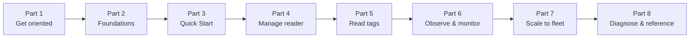
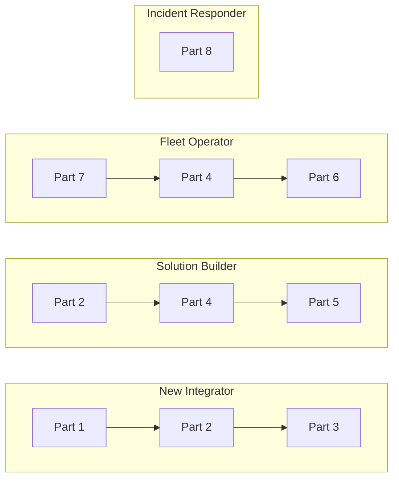

> 📘 **EXPLANATION** · **Audience:** All · **Read time:** ~3 min

This documentation is organised into eight Parts that follow the developer's actual workflow: get oriented, read the foundations, walk the Quick Start, manage the reader, read tags, observe what happens, scale to a fleet, and diagnose problems. The order is a dependency chain — content in any Part assumes you have read or skimmed earlier Parts as needed.

### The eight Parts

- **Part 1: Get oriented**: where to start, the MQTT primer, how this site pairs with the MQTT API Reference
- **Part 2: Foundations**: what IOTC is, which sled you have, the actors, the bootstrap tools, how commands and responses flow
- **Part 3: Quick start**: a seven-phase end-to-end walkthrough from a sealed box to live inventory
- **Part 4: Manage your reader**: device state, network, MQTT endpoints, TLS, configuration document, firmware
- **Part 5: Read tags**: operating-mode profiles, start/stop, post-filters
- **Part 6: Observe and monitor**: configure events, heartbeats, alerts, MQTT connection, tag-data event schema
- **Part 7: Scale to a fleet**: provisioning models, bulk management, retention and retry
- **Part 8: Diagnose and reference**: symptoms, failure modes, where things fail, recovery playbooks, misconceptions, glossary, API reference, release notes

### About the content-type badges

Every page in this documentation carries one of four badges:

- 📘 **Explanation** — discusses a topic: what it is, why it works the way it does, what trade-offs apply. Read these to understand.
- 📗 **Tutorial**, a guided lesson with visible results at every step. Read these to learn by doing.
- 📙 **How-to guide** — directions for accomplishing a specific real-world task. Read these to act.
- 📕 **Reference**, the technical facts: endpoints, fields, types, errors. Look these up while working.

The badges follow the [Diátaxis framework](https://diataxis.fr/). Pages are exactly one type, the documentation does not mix modes on a single page.

### Recommended reading paths by persona

| If you are … | Start here |
|---|---|
| New to IOTC and want to read a tag in an hour | [Quick Start Tutorial](/quick-start/overview) |
| Architecting a multi-reader deployment | [System Architecture](/foundations/architecture/end-to-end), then [Fleet Provisioning](/fleet/provisioning-models) |
| Writing integration code against the MQTT API | [API Reference](/reference/api-overview) |
| Operating an existing fleet at 3 a.m. | [Troubleshooting Guide](/diagnose/symptoms) |

### How to navigate

Every page carries breadcrumbs (Part > Page), a right-side table of contents, and a "Related" box linking complementary-quadrant pages. The search bar accepts both endpoint names and natural-language queries.

**Related:** 📘 [System Architecture](/foundations/architecture/end-to-end) · 📘 [MQTT Core Concepts](/foundations/mqtt-primer) · external: [diataxis.fr](https://diataxis.fr/)
