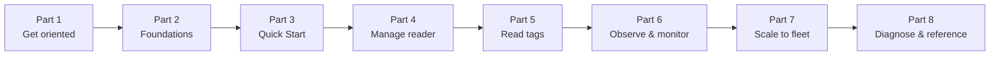
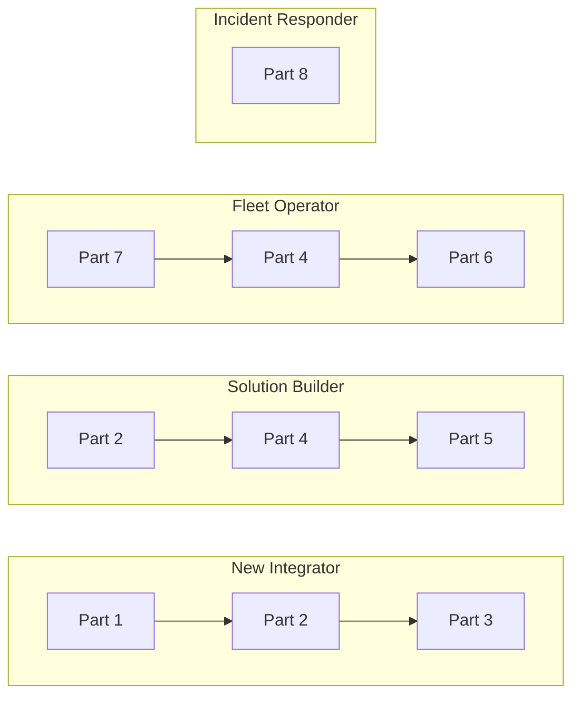

> 📘 **EXPLANATION** · Audience: All · Read time: ~3 min

This documentation is organised into seven Parts that follow the developer's actual workflow: discover the system, get started, set up infrastructure, operate the RFID radio, observe what happens, manage at fleet scale, and look things up. The order is a dependency chain — content in any Part assumes you have read or skimmed earlier Parts as needed.

### The seven Parts

- **Part I: Foundations**: what this is, what's in it, how MQTT works
- **Part II: Getting Started**: prerequisites and the Quick Start tutorial
- **Part III: Infrastructure**: network, security, MQTT endpoints
- **Part IV: RFID Operations**: operating modes, post-filters, tag data
- **Part V: Observability & Events**: heartbeats, alerts, exceptions, monitoring
- **Part VI: Fleet Operations**: provisioning, bulk configuration, migration, cloud integration
- **Part VII: Reference & Troubleshooting**: endpoint reference, error codes, troubleshooting, FAQ, appendices

### About the content-type badges

Every page in this documentation carries one of four badges:

- 📘 **Explanation** — discusses a topic: what it is, why it works the way it does, what trade-offs apply. Read these to understand.
- 📗 **Tutorial**, a guided lesson with visible results at every step. Read these to learn by doing.
- 📙 **How-to guide** — directions for accomplishing a specific real-world task. Read these to act.
- 📕 **Reference**, the technical facts: endpoints, fields, types, errors. Look these up while working.

The badges follow the [Diátaxis framework](https://diataxis.fr/). Pages are exactly one type, the documentation does not mix modes on a single page.

### Recommended reading paths by persona

| If you are … | Start here |
|---|---|
| New to IOTC and want to read a tag in an hour | [§5 Quick Start Tutorial](#chapter-5--quick-start-tutorial) |
| Architecting a multi-reader deployment | [§2 System Architecture](#chapter-2--system-architecture), then [§13 Fleet Provisioning](#chapter-13--fleet-provisioning) |
| Writing integration code against the MQTT API | [§16 API Reference](#chapter-16--mqtt-api-reference) |
| Operating an existing fleet at 3 a.m. | [§18 Troubleshooting Guide](#chapter-18--troubleshooting-guide) |

### How to navigate

Every page carries breadcrumbs (Part > Chapter > Section), a right-side table of contents, and a "Related" box linking complementary-quadrant pages. The search bar accepts both endpoint names and natural-language queries.

**Related:** 📘 [§2 System Architecture](#chapter-2--system-architecture) · 📘 [§3 MQTT Core Concepts](#chapter-3--mqtt-core-concepts) · external: [diataxis.fr](https://diataxis.fr/)
