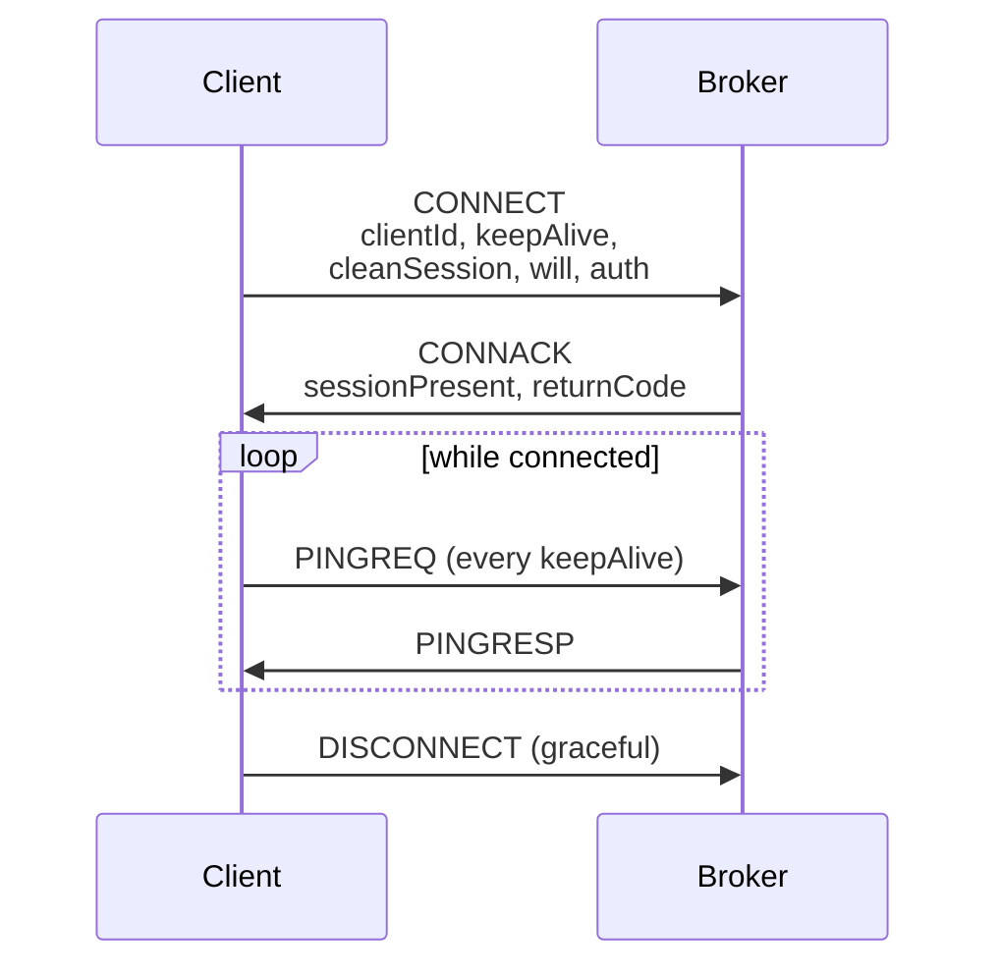
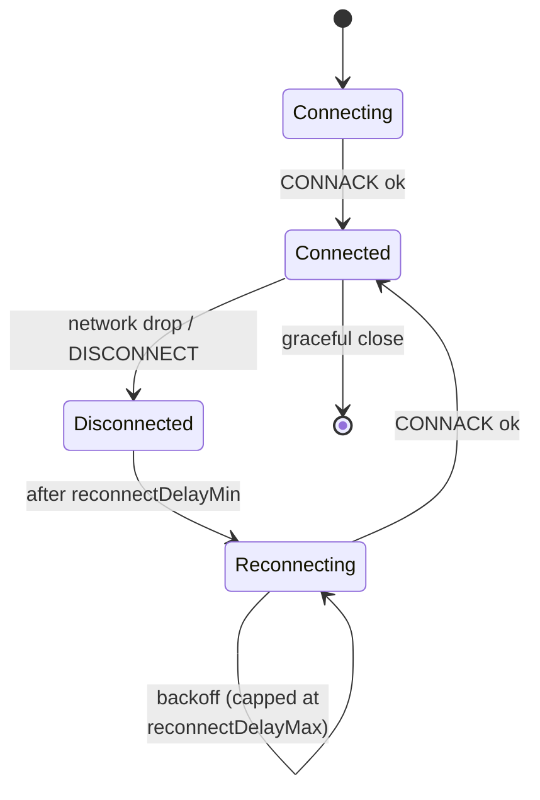

> 📘 **EXPLANATION** · Audience: Solution Builder · Read time: ~5 min

An MQTT client's connection to the broker is a stateful, long-lived TCP session. Its lifecycle has named stages, and understanding them is the difference between diagnosing a flaky reader in five minutes and chasing it for an afternoon.

### CONNECT and CONNACK

A client begins by sending a CONNECT packet containing its client identifier, credentials, optional LWT, keep-alive interval, and clean-session flag. The broker replies with CONNACK (accept or reject). From this point the connection is established.

### Keep-alive. PINGREQ and PINGRESP

The client and broker agree on a keep-alive interval at CONNECT time. If no data has flowed for that interval, the client sends a PINGREQ; the broker replies with PINGRESP. If either side fails to receive expected traffic for one and a half keep-alive intervals, it considers the peer dead and closes the connection.

For battery-powered handheld readers, keep-alive interval is a direct battery-vs-responsiveness trade-off. Shorter intervals detect outages faster but use more battery. The default chosen for IOTC reflects this balance.

### Clean session vs persistent session

A clean-session client tells the broker "do not preserve state for me", no queued messages, no subscription persistence. A persistent-session client (clean-session false) asks the broker to retain its subscriptions and queue QoS 1 messages while it is offline. IOTC readers use **persistent sessions** so that commands and alerts buffered during a transient disconnect are delivered on reconnect.

### Reconnection behaviour on the handheld

The handheld sled's MQTT connection rides over its Bluetooth link to the host device. When BT drops — reader pocketed, host moved out of range, the MQTT connection drops too. The reader's firmware detects this and attempts reconnection with exponential backoff. Once BT is re-established and Wi-Fi is reachable, the persistent session resumes and queued QoS 1 messages flow.

### Battery implications

Each PINGREQ wakes the radio. A 30-second keep-alive at moderate battery draws ~3% extra per shift compared to a 120-second keep-alive. For deployments where battery is the binding constraint, increase the keep-alive interval and accept slightly slower offline-detection latency. The trade-off is operational, not protocol-level.

**Related:** 📘 [§2.5 Handheld Considerations](/foundations/architecture/handheld-considerations) · 📘 [§11.7 MQTT Connection Events](/observability/events/mqtt-connection) · 📙 [§12.3 Connection Quality](/observability/monitoring/connection-quality) · 📕 [§16.6 mqttConnEVT](#chapter-16--mqtt-api-reference)
