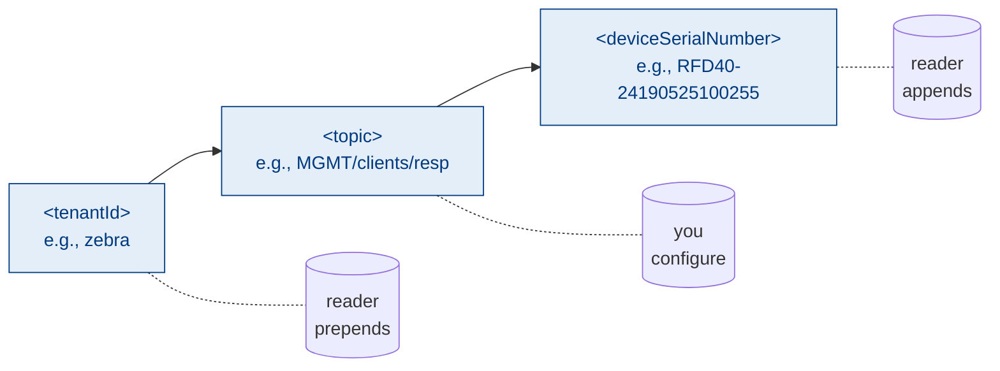
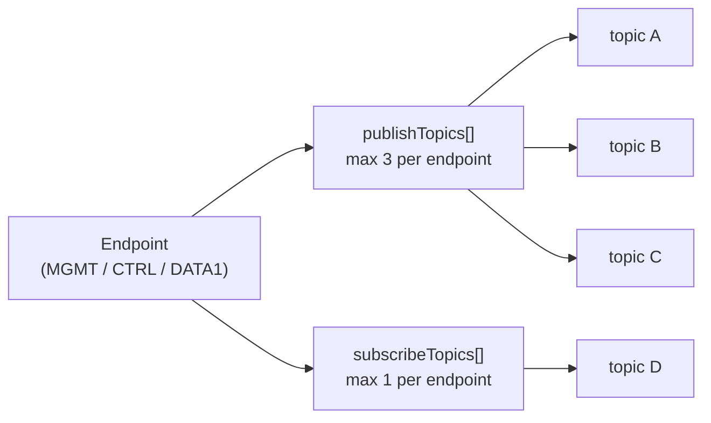

> 📘 **EXPLANATION** · Audience: All · Read time: ~5 min

Every MQTT topic produced by or consumed by an IOTC reader follows a three-part structure:

```
<tenantId> / <topic> / <deviceSerialNumber>
```

The reader handles the first and third segments automatically; the documentation, the deployment configuration, and the application code only ever specify the middle segment.

### What each segment means

- **`tenantId`**, the customer's tenant identifier, assigned during account provisioning. Stable per tenant. Configured once on the reader (carried in `mqttParams.tenantId` in the endpoint's `epConfig`).
- **`topic`**, the **user-chosen middle segment**, configured per endpoint via `publishTopics` and `subscribeTopics`. An endpoint may publish to up to 3 topics and subscribe to 1.
- **`deviceSerialNumber`**, the reader's hardware serial. Stable per device. The reader appends this automatically based on its own identity (returned by [`get_version`](https://aa5123.github.io/RFID-40-90-handled-reader-api-reference-documentatiion/#op-get-version)).

### Worked example

If `tenantId` is `zebra`, the `publishTopics[0].topic` is `MGMT/clients/cmnd`, and the device serial is `RFD40-24190525100255`, the reader publishes to:

```
zebra/MGMT/clients/cmnd/RFD40-24190525100255
```

A subscriber — typically your application — subscribes to that exact topic to receive whatever the reader publishes on this endpoint.

### Conventions in the source examples

The source schemas use these middle-segment conventions consistently (you are free to choose your own):

| `topic` segment | Purpose convention |
|---|---|
| `MGMT/clients/cmnd` | Management commands inbound |
| `MGMT/clients/resp` | Management responses outbound |
| `MGMT/clients/event` | Management events (heartbeat, alerts) outbound |
| `MGMT/clients/rfid` | RFID tag data outbound on MGMT-shared endpoint |
| `CTRL/clients/cmnd` | Control commands inbound |
| `CTRL/clients/resp` | Control responses outbound |
| `CTRL/clients/rfid` | Tag data outbound on CTRL-shared endpoint |

### Why this structure

Three reasons motivated the three-part design:

1. **Tenant isolation**, every topic in the namespace is prefixed by the tenant ID. Topic ACLs at the broker scope a credential to its tenant subtree.
2. **Per-device routing**, the device serial in the suffix lets wildcard fleet subscriptions and per-device commands coexist naturally.
3. **Per-endpoint flexibility**, the middle segment is per-endpoint, so the deployment can route MGMT and CTRL on the same broker or split them across brokers without changing topic semantics.

### Per-endpoint topic limits

- **Maximum 3 publish topics** per endpoint (exceeding this returns error code 25 — `IOT_ERROR_PUBLISH_TOPICS_EXCEEDED`).
- **Maximum 1 subscribe topic** per endpoint (exceeding returns error code 26 — `IOT_ERROR_SUBSCRIBE_TOPIC_EXCEEDED`).
- **`tenantId` length is bounded** (exceeding returns error code 27 — `IOT_ERROR_INVALID_TENANTID_LENGTH`).





**Related:** 📘 [§2.4 Interface Model](/foundations/architecture/interface-model) · 📘 [§8.1 Endpoint Configuration](/infrastructure/endpoints/about) · 📙 [§8.3 Configure Endpoints](/infrastructure/endpoints/configure) · 📕 [§20.2 Topic Quick Reference](/reference/appendices/topic-quick-reference)

---

# Part II: Getting Started (corrected)
