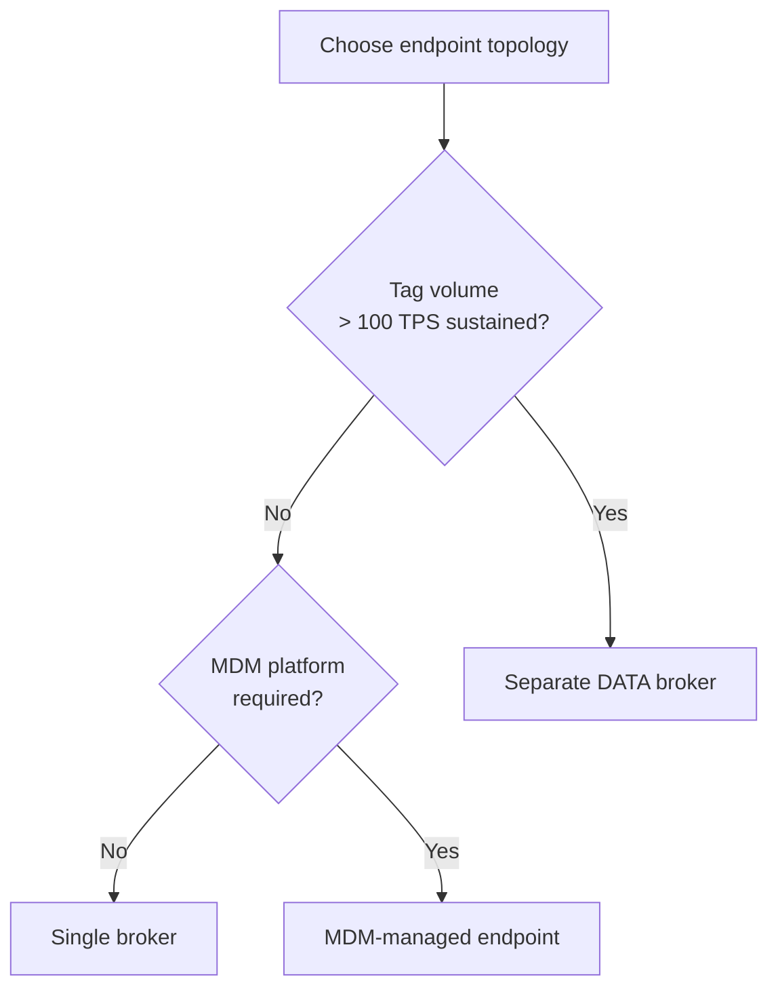

> 📙 **HOW-TO** · Audience: Solution Builder · Time: ~10 min

This guide shows you how to set the broker target for one or more MQTT interfaces.

### Decide: single or separate brokers

If you have no specific reason to separate, **use a single broker for all interfaces**. Separate brokers are an architectural choice with operational cost; see [§8.4](/infrastructure/endpoints/multi-endpoint).

### Configure an interface

```json
{
  "command": "config_endpoint",
  "command_id": "ep-set-1",
  "data": {
    "interface": "ctrl",
    "host": "iotc-broker.zebra.com",
    "port": 8883,
    "tls": true,
    "username": "<user>",
    "password": "<password>",
    "ca_alias": "broker-ca"
  }
}
```

Repeat for `mgmt`, `data`, `mdm` as needed.

### Validate the change

Watch `mqttConnEVT` for the affected interface, you should see a disconnect from the old endpoint followed by a connect to the new one within seconds.

### Rollback if connectivity is lost

If the new endpoint configuration causes loss of MQTT connectivity:

1. Dock the reader in a cradle with USB access to 123RFID Desktop.
2. Restore the previous endpoint configuration.
3. Reapply and verify.

This is why endpoint changes should be canaried on a single device before fleet rollout.



**Related:** 📘 [§8.4 Multi-Endpoint Architectures](/infrastructure/endpoints/multi-endpoint) · 📙 [§7.4 TLS Setup](/infrastructure/security/tls-setup) · 📕 [§16.2 config_endpoint](#chapter-16--mqtt-api-reference) · 📕 [§16.6 mqttConnEVT](#chapter-16--mqtt-api-reference)
