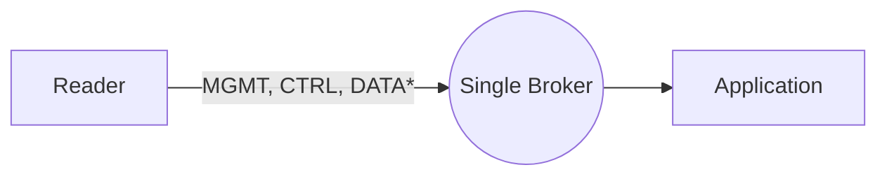
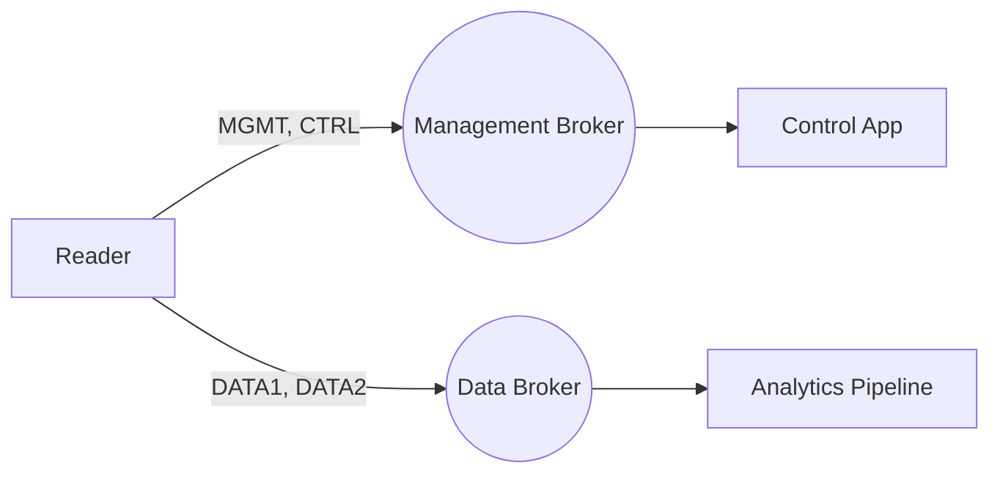
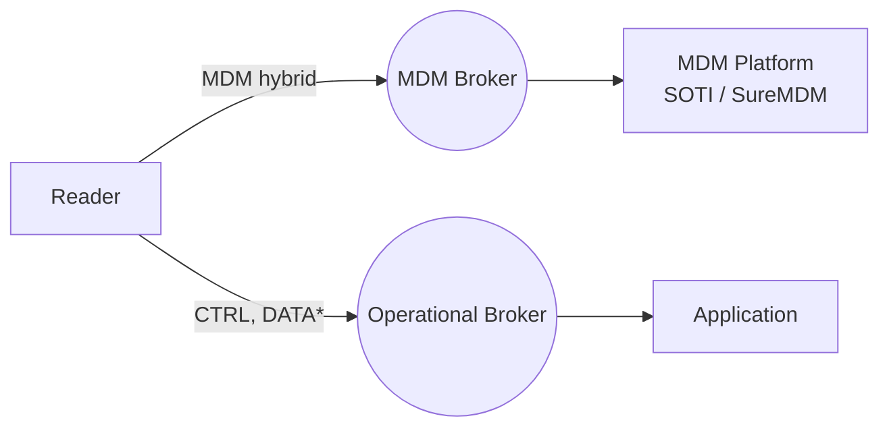

> 📘 **EXPLANATION** · **Audience:** Solution Builder · **Read time:** ~6 min

Three architectural patterns are available for IOTC deployments. The differences matter when fleet size or tag volume reaches scale.

### Single-broker architecture

All four interfaces connect to the same broker. The simplest pattern; recommended for deployments below a few hundred readers.

**Use when:** straightforward operations matter more than scale specialisation.

### Separate data broker

MGMT, CTRL, and MDM share one broker; DATA routes to a dedicated tag-data broker (commonly a managed IoT platform).

**Use when:** tag volume threatens to starve command-response latency, or DATA needs to flow directly into a cloud analytics pipeline.

### MDM-managed endpoint

SOTI Connect sets the endpoint configuration on the reader's behalf; the reader does not need application-side endpoint configuration.

**Use when:** enterprise MDM is mandated by IT policy or fleet operations.

### Trade-offs

Separate brokers add operational complexity (two sets of credentials, two health metrics, partial-connectivity failure modes) but buy isolation and specialisation. The pattern is justified when scale, latency, or organisational policy demand it, not by default.

**Related:** 📘 [Endpoint Configuration](/infrastructure/endpoints/about) · 📙 [Configure Endpoints](/infrastructure/endpoints/configure) · 📘 [Cloud Integration Patterns](/fleet/cloud-integration/patterns)

---

# Part IV: RFID Operations
