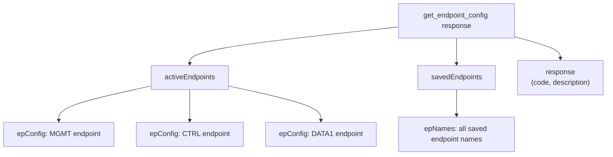

> 📙 **HOW-TO** · Audience: All · Time: ~2 min

This guide shows you how to inspect the current MQTT endpoint configuration on a handheld reader.

### Issue the command

```json
{"command": "get_endpoint_config", "command_id": "ep-1"}
```

### Interpret the response

```json
{
  "response": "get_endpoint_config",
  "command_id": "ep-1",
  "data": {
    "mgmt": {"host": "iotc-broker.zebra.com", "port": 8883, "tls": true},
    "ctrl": {"host": "iotc-broker.zebra.com", "port": 8883, "tls": true},
    "data": {"host": "iotc-broker.zebra.com", "port": 8883, "tls": true},
    "mdm":  {"host": "soti.example.com", "port": 8883, "tls": true}
  }
}
```

Each interface block shows its broker target. For the full schema, see [§16.2](#chapter-16--mqtt-api-reference).



**Related:** 📘 [§8.1 Endpoint Configuration](/infrastructure/endpoints/about) · 📕 [§16.2 get_endpoint_config](#chapter-16--mqtt-api-reference) · 📙 [§8.3 How to Configure](/infrastructure/endpoints/configure)
