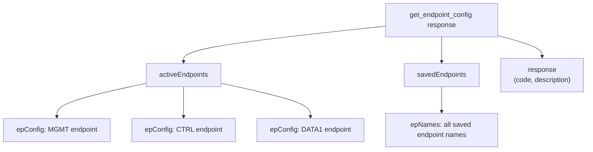

> 📙 **HOW-TO** · Audience: All · Time: ~2 min

This guide shows you how to inspect the current MQTT endpoint configuration on a handheld reader.

### Issue the command

```json
{"command": "get_endpoint_config", "command_id": "ep-1"}
```

### Interpret the response

```json
{
  "response": "get_endpoint_config",
  "command_id": "ep-1",
  "data": {
    "mgmt": {"host": "iotc-broker.zebra.com", "port": 8883, "tls": true},
    "ctrl": {"host": "iotc-broker.zebra.com", "port": 8883, "tls": true},
    "data": {"host": "iotc-broker.zebra.com", "port": 8883, "tls": true},
    "mdm":  {"host": "soti.example.com", "port": 8883, "tls": true}
  }
}
```

Each interface block shows its broker target. For the full schema, see [API Reference](/reference/api-overview).



**Related:** 📘 [Endpoint Configuration](/infrastructure/endpoints/about) · 📕 [get_endpoint_config](https://aa5123.github.io/RFID-40-90-handled-reader-api-reference-documentatiion/#op-get-endpoint-config) · 📙 [How to Configure](/infrastructure/endpoints/configure)
