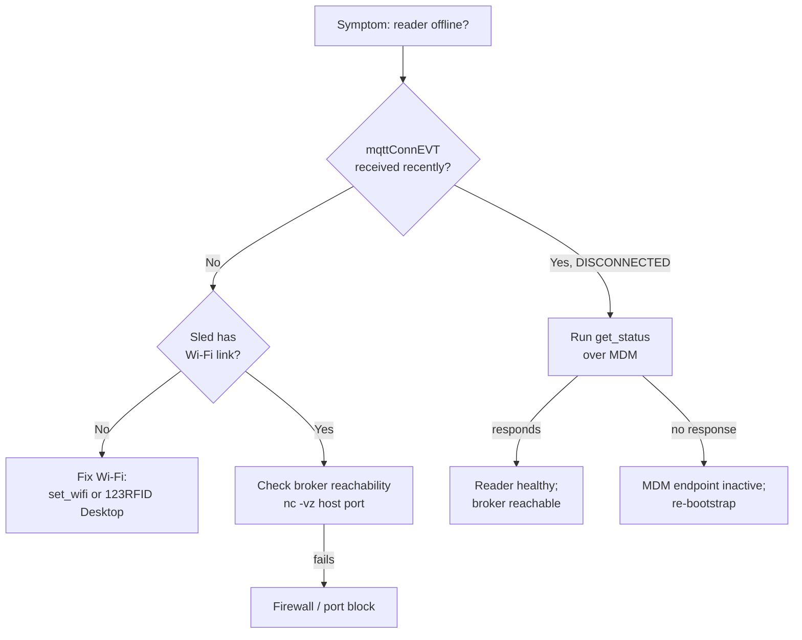

> 📙 **HOW-TO** · Audience: Fleet Operator · Time: ~10 min

This guide shows you how to diagnose common network failures on a handheld reader.

### Symptom: Wi-Fi association fails

Issue [`get_wifi`](https://aa5123.github.io/RFID-40-90-handled-reader-api-reference-documentatiion/#op-get-wifi). Check the `last_error` field on the profile that should be active.

- `auth_failed` to wrong passphrase or invalid EAP credentials
- `no_signal` to SSID not reachable (out of range, AP down)
- `dhcp_failed` to associated but did not receive an IP

### Symptom: DHCP failure

[`get_wifi`](https://aa5123.github.io/RFID-40-90-handled-reader-api-reference-documentatiion/#op-get-wifi) shows associated but no IP. Check:

- The Wi-Fi network's DHCP scope has free leases
- The reader's MAC address is not blocked by MAC filtering
- The host device, if relaying, has its own IP and can reach DHCP

### Symptom: DNS resolution failure

The reader has an IP but cannot reach the broker hostname. Check:

- The configured DNS in [`get_wifi`](https://aa5123.github.io/RFID-40-90-handled-reader-api-reference-documentatiion/#op-get-wifi) response is reachable
- The broker hostname (`iotc-broker.zebra.com` or your customer broker) resolves on a control machine in the same network

### Symptom: firewall blocks 1883/8883

Connection drops at TCP layer before MQTT CONNECT. Check:

- Outbound TCP/8883 (TLS) or TCP/1883 (cleartext) is permitted from the host's network to the broker
- No proxy is intercepting MQTT traffic without configuration

### Diagnostic command sequence

For systematic diagnosis, run in order:

1. [`get_status`](https://aa5123.github.io/RFID-40-90-handled-reader-api-reference-documentatiion/#op-get-status) — does the reader respond at all over MQTT? If yes, the path is fundamentally working.
2. [`get_wifi`](https://aa5123.github.io/RFID-40-90-handled-reader-api-reference-documentatiion/#op-get-wifi) — Wi-Fi association and DHCP state
3. [`get_endpoint_config`](https://aa5123.github.io/RFID-40-90-handled-reader-api-reference-documentatiion/#op-get-endpoint-config) — broker target settings
4. Inspect `heartbeatEVT` events over a 5-minute window for connection-quality dropouts

**Related:** 📙 [Wi-Fi Configuration](/infrastructure/network/wifi) · 📙 [Connection Troubleshooting](/reference/troubleshooting/connection) · 📕 [get_status / get_wifi](https://aa5123.github.io/RFID-40-90-handled-reader-api-reference-documentatiion/#op-get-status)
