> 📙 **HOW-TO** · Audience: Fleet Operator · Time: ~30 min

This guide shows you how to rotate TLS certificates across a fleet of handheld readers without downtime.

### Monitor for expiration

Subscribe to the certificate-expiry `alerts` event. Configure the warning threshold via [`config_events`](https://aa5123.github.io/RFID-40-90-handled-reader-api-reference-documentatiion/#op-config-events), typically 30 days before expiration.

### Stage the new certificate to a canary cohort

Select 1–5% of the fleet. Issue [`install_certificate`](https://aa5123.github.io/RFID-40-90-handled-reader-api-reference-documentatiion/#op-install-certificate) for each canary reader with the new certificate under a **new alias** (e.g., `client-cert-2026`). Do not delete the old certificate.

### Cut over the canary

Update the canary readers' [`config_endpoint`](https://aa5123.github.io/RFID-40-90-handled-reader-api-reference-documentatiion/#op-config-endpoint) to reference the new certificate alias. Watch `mqttConnEVT` confirm secure reconnection.

### Widen the rollout in waves

| Wave | % of fleet | Wait before next wave | Pass criteria |
|---|---:|---|---|
| 1 | 1% (canary) | 24 hours | Zero cert-related `exceptionEVT` |
| 2 | 10% | 24 hours | Same |
| 3 | 50% | 12 hours | Same |
| 4 | 100% | — | Same |

```mermaid
gantt
  title Certificate rotation rollout
  dateFormat HH:mm
  axisFormat %H:%M
  section Wave 1 (canary, 1%)
    Install + monitor :a1, 00:00, 24h
  section Wave 2 (10%)
    Install + monitor :a2, after a1, 24h
  section Wave 3 (50%)
    Install + monitor :a3, after a2, 12h
  section Wave 4 (100%)
    Install :a4, after a3, 8h
```

### Handle install failures

If [`install_certificate`](https://aa5123.github.io/RFID-40-90-handled-reader-api-reference-documentatiion/#op-install-certificate) returns an error, the reader retains its existing certificate and remains operational. Log the failure, fix the cause, and retry. Do not delete the old certificate until the new one is verified working.

### Verify and clean up

Once 100% of the fleet is on the new alias, issue [`delete_certificate`](https://aa5123.github.io/RFID-40-90-handled-reader-api-reference-documentatiion/#op-delete-certificate) for the old alias.

**Related:** 📙 [§7.2 Certificate Management](/infrastructure/security/certificate-management) · 📙 [§13.4 Automation](/fleet/provisioning/automation) · 📕 [§16.6 alerts](#chapter-16--mqtt-api-reference) · 📙 [§14.6 Phased Rollout Pattern](/fleet/migration/execute)
