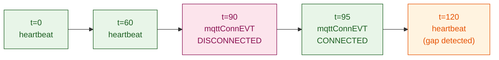

> 📙 **HOW-TO** · Audience: Fleet Operator · Time: ~10 min

This guide shows you how to monitor the connection quality of a handheld reader continuously.

### Wi-Fi signal strength

The `heartbeatEVT.data.wifi_rssi` field reports the current Wi-Fi signal strength. Typical operational range: −40 to −70 dBm. Sustained values below −75 dBm indicate marginal Wi-Fi; the reader may roam between APs frequently.

### Bluetooth link quality

The `heartbeatEVT.data.bt_link_quality` field reports the BT link health (0–100 scale). Values below 40 indicate degraded BT — operator may be moving in and out of range or operating in an RF-noisy environment.

### MQTT connection stability

Maintain a count of `mqttConnEVT` transitions per reader over rolling windows. A reader with more than 10 reconnects per hour likely has a connectivity issue — Wi-Fi roaming, BT instability, or broker capacity.

### Correlating to environmental causes

| Pattern | Likely cause |
|---|---|
| Wi-Fi RSSI degrades during certain shift hours | RF interference from other equipment |
| BT link quality drops when operator walks far from host | Host should be carried, not stationary |
| Reconnects coincident with AP boundaries | Wi-Fi roaming; check AP placement and channels |
| Reconnects with no Wi-Fi/BT signal correlation | Investigate broker or upstream network |

**Related:** 📕 [heartbeatEVT and mqttConnEVT](https://aa5123.github.io/RFID-40-90-handled-reader-api-reference-documentatiion/#tag-heartbeatevt) · 📘 [MQTT Connection Events](/observability/mqtt-connection) · 📙 [Connection Troubleshooting](/reference/troubleshooting/connection)
