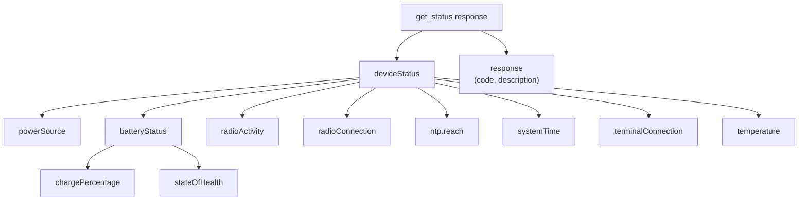

> 📙 **HOW-TO** · Audience: Fleet Operator · Time: ~5 min

This guide shows you how to check the health of a handheld reader on demand and continuously.

### On-demand: [`get_status`](https://aa5123.github.io/RFID-40-90-handled-reader-api-reference-documentatiion/#op-get-status)

```json
{"command": "get_status", "command_id": "status-1"}
```

The response includes operating state (idle/running), battery level, temperature, firmware version, uptime, and connection states per interface. For the full field list, see [API Reference](/reference/api-overview).



### Continuous: subscribe to `heartbeatEVT`

For a reader on its MGMT interface, subscribe to:

```
{tenantId}/mgmt/clients/<channel>/<deviceSerial>
```

and filter on `event == "heartbeatEVT"`. Heartbeats arrive at the configured interval (see [Configure events](/observability/configure-events)).

### Combine the two

[`get_status`](https://aa5123.github.io/RFID-40-90-handled-reader-api-reference-documentatiion/#op-get-status) gives a point-in-time snapshot; `heartbeatEVT` gives a stream. Combine for resilience: query [`get_status`](https://aa5123.github.io/RFID-40-90-handled-reader-api-reference-documentatiion/#op-get-status) at startup or on demand; trust `heartbeatEVT` for ongoing state. If they disagree, the more recent timestamp wins.

**Related:** 📕 [get_status](https://aa5123.github.io/RFID-40-90-handled-reader-api-reference-documentatiion/#op-get-status) · 📕 [heartbeatEVT](https://aa5123.github.io/RFID-40-90-handled-reader-api-reference-documentatiion/#tag-heartbeatevt) · 📘 [Heartbeat Events](/observability/heartbeat)
