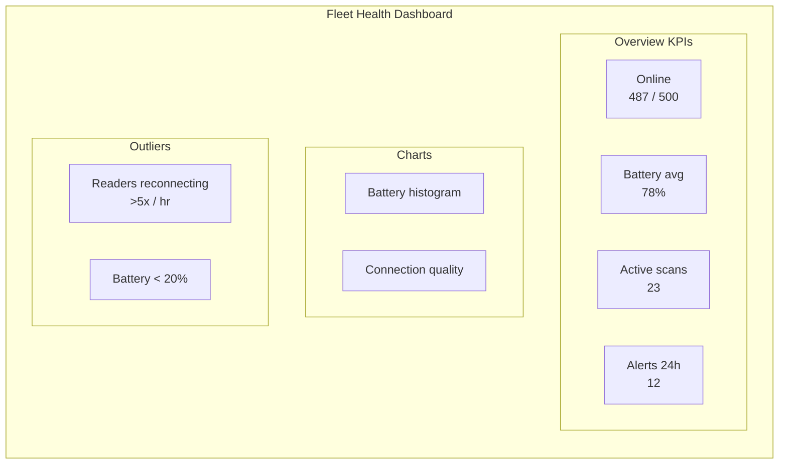
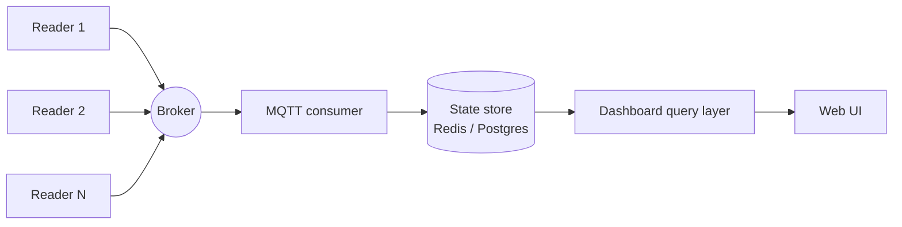

> 📙 **HOW-TO** · Audience: Solution Builder · Time: ~30 min

This guide shows you how to build a fleet health dashboard from IOTC events.

### Subscribe with a wildcard for fleet-wide visibility

```
{tenantId}/mgmt/clients/+/+
```

This delivers every MGMT-interface event (heartbeats, alerts, exceptions, connection events) from every reader on the tenant to your subscriber.

### Aggregate by serial number

Maintain a per-reader record keyed by `deviceSerial`:

```python
fleet_state = {}  # serial -> {last_heartbeat, battery, state, alerts_count, ...}

def on_event(topic, payload):
    serial = extract_serial_from_topic(topic)
    record = fleet_state.setdefault(serial, default_record())
    if payload["event"] == "heartbeatEVT":
        record.update(payload["data"])
        record["last_heartbeat"] = now()
    elif payload["event"] == "alerts":
        record["alerts_count"] += 1
        record["last_alert"] = payload
    ...
```

### Reference architectures

- **Grafana**: write aggregated metrics to Prometheus or InfluxDB; build panels for online count, battery distribution, alert counts, reconnect rates.
- **Azure IoT Central**: native MQTT consumption; dashboards and alerting built in.
- **AWS IoT Core**, use rules to route events into CloudWatch or DynamoDB; build dashboards in QuickSight or Grafana.

Each architecture's setup is in the relevant cloud-integration how-to ([AWS IoT Core](/fleet/cloud-integration/aws)–[GCP integration](/fleet/cloud-integration/gcp)).

### Key metrics to display

- **Online count**: readers with a heartbeat in the last 3× interval
- **Battery distribution**: histogram of `battery_percent` across the fleet
- **Active operations count**: readers in `running` state
- **Alert counts**: last 24h, segmented by category
- **Connection-quality outliers**: readers with reconnect rate above threshold





### Alerting integration

Route critical alerts (battery critical, sustained connection loss, high exception rates) to PagerDuty, Opsgenie, or Slack via webhook from your dashboard backend. Threshold tuning is operational — start with conservative thresholds and tighten as the fleet's baseline stabilises.

**Related:** 📕 [events](/reference/api-overview) · 📙 [AWS IoT Core](/fleet/cloud-integration/aws) · 📙 [Azure IoT Hub](/fleet/cloud-integration/azure) · 📘 [Alert Events](/observability/alerts)

---

# Part VI: Fleet Operations
