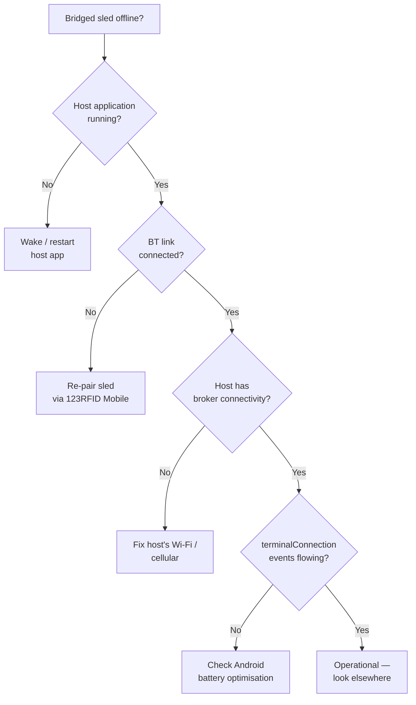

> 📙 **HOW-TO** · Audience: All · Time: ~10 min per symptom

This guide shows you how to troubleshoot Bluetooth and host-device-related issues.

#### Symptom: reader sled not pairing with host

- Power-cycle the sled by holding the trigger for 5 seconds.
- Remove any existing pairing on the host device first.
- Ensure no other host is currently connected to the sled (sled connects to one host at a time).

#### Symptom: Bluetooth disconnections during operation

- Range: the operator is moving away from the host (most common).
- Interference: 2.4 GHz environments (microwaves, dense Wi-Fi) degrade BT.
- Host BT subsystem: try the same sled with a different host device to isolate.

#### Symptom: multiple host device conflicts

- The most recently connected host wins. Explicitly disconnect from the prior host.

#### Symptom: host application not forwarding MQTT traffic

- The host application that mediates sled ↔ broker traffic may be suspended by Android's battery optimization. Whitelist the app in Android settings.
- Verify the host has its own MQTT path to the broker by running a test MQTT client on the host directly.

**Related:** 📙 [§4.4 Bluetooth Pairing](/getting-started/prerequisites/bluetooth-pairing) · 📘 [§2.5 Handheld Considerations](/foundations/architecture/handheld-considerations)
