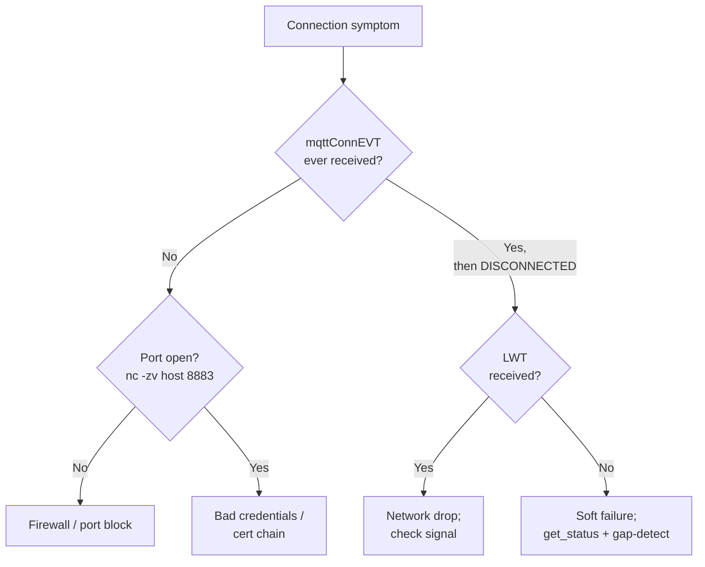

> 📙 **HOW-TO** · Audience: All · Time: ~15 min per symptom

This guide shows you how to troubleshoot MQTT connection issues on handheld readers.

#### Symptom: reader not appearing on broker

The reader has been bootstrapped but does not show up in your MQTT subscriber.

- Verify the reader is powered on and its host device is connected to the network.
- Verify the host device can resolve the broker hostname.
- Verify the credentials in [`config_endpoint`](https://aa5123.github.io/RFID-40-90-handled-reader-api-reference-documentatiion/#op-config-endpoint) match the broker's expectations.

#### Symptom: reader connects then immediately disconnects

`mqttConnEVT` fires with `new_state: connected` followed seconds later by `new_state: disconnected`.

- Auth failure: check the broker logs for the disconnect reason.
- ACL failure: verify the credential has permission on the topic family it tries to publish to.
- LWT firing prematurely: check keep-alive interval is reasonable.

#### Symptom: intermittent disconnections

`mqttConnEVT` shows frequent disconnect/reconnect cycles.

- Wi-Fi roaming: check Wi-Fi RSSI in heartbeats; if it varies wildly, the host is moving between APs.
- Bluetooth instability: check BT link quality.
- Keep-alive too aggressive for the network: increase from 30 s to 60 s.

#### Symptom: TLS handshake failures

`exceptionEVT` with code `2001 cert_validation_failed`.

- Verify the installed CA matches the broker's server certificate chain.
- Verify the certificate has not expired.
- Verify the reader's clock is reasonably correct (clock skew > 24 h can fail TLS validation).

#### Symptom: authentication failures

`exceptionEVT` with code `2002 auth_failed`.

- Verify username and password match exactly (no trailing whitespace).
- For mutual TLS, verify the client certificate is currently valid and unrevoked.

#### Symptom: firewall blocks 1883/8883

Connection never establishes; no `mqttConnEVT` ever fires.

- Test outbound 8883 from the host device's network using `nc -zv broker.example.com 8883`.
- Coordinate with network operations to allow outbound MQTT traffic to the broker.

**Related:** 📙 [Network Troubleshooting](/infrastructure/network/troubleshooting) · 📙 [TLS Setup](/infrastructure/security/tls-setup) · 📕 [mqttConnEVT, exceptionEVT](https://aa5123.github.io/RFID-40-90-handled-reader-api-reference-documentatiion/#tag-mqttconnevt) · 📘 [Connection Lifecycle](/foundations/mqtt/connection-lifecycle)
