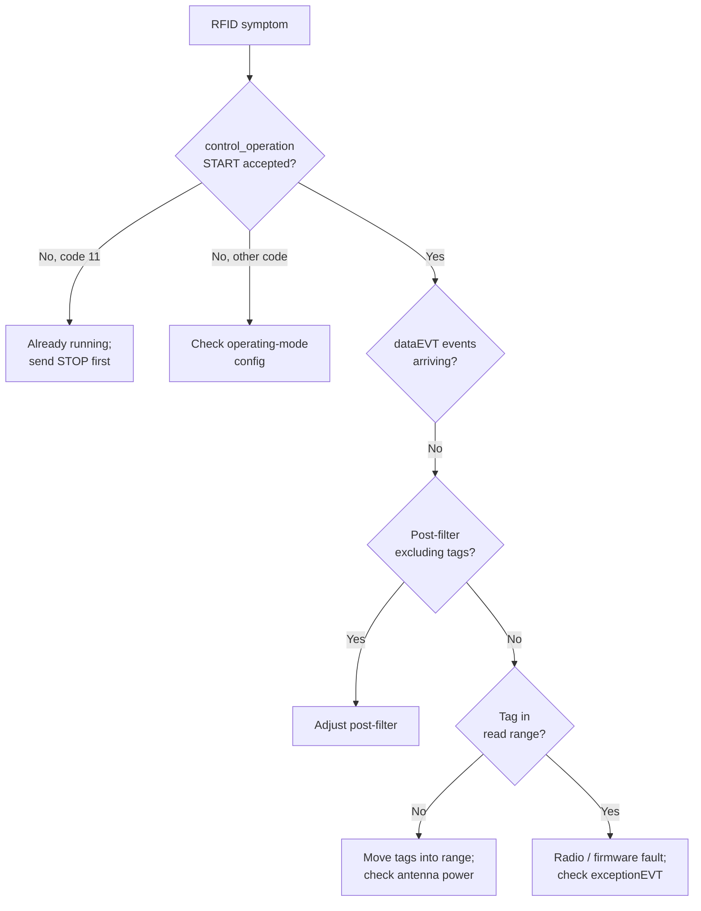

> 📙 **HOW-TO** · Audience: All · Time: ~15 min per symptom

This guide shows you how to troubleshoot RFID read failures on handheld readers.

#### Symptom: operation start succeeds but no tags read

- Verify tags are present in the field — wave a known-good tag close to the sled.
- Check [`get_post_filter`](https://aa5123.github.io/RFID-40-90-handled-reader-api-reference-documentatiion/#op-get-post-filter), an over-restrictive include filter drops everything.
- Check [`get_operating_mode`](https://aa5123.github.io/RFID-40-90-handled-reader-api-reference-documentatiion/#op-get-operating-mode) `rf_power` — too-low power reduces effective range.
- Check the regulatory region — wrong region can disable the radio entirely.

#### Symptom: very low read rate / poor performance

- Tag orientation: linear tags read poorly when oriented perpendicular to the antenna.
- Tag population density: very large populations may need session tuning (S0 vs S1).
- Mode choice: `inventory_tid` is inherently slower than `inventory` — consider switching if TID is not actually needed.

#### Symptom: unexpected tags in results

- Filter not working: re-check filter pattern, offset, and length.
- Wildcard subscription delivering tags from another reader: verify topic subscription uses the right serial number.

#### Symptom: operation stops unexpectedly

- Check `exceptionEVT` for code `1002 rfid_radio_fault`.
- Battery dropped below operational threshold: check `heartBeatEVT.data.battery_percent`.
- Trigger was released (in `press_to_start` mode): operator-initiated stop is normal.

**Related:** 📙 [§9.2 Configure Operating Mode](/rfid/operating-mode/configure) · 📙 [§9.3b Configure Filters](/rfid/operating-mode/post-filters-configure) · 📕 [§16.3 CTRL endpoints](#chapter-16--mqtt-api-reference) · 📕 [§17.3 Exception Codes](#173--exception-event-codes)
