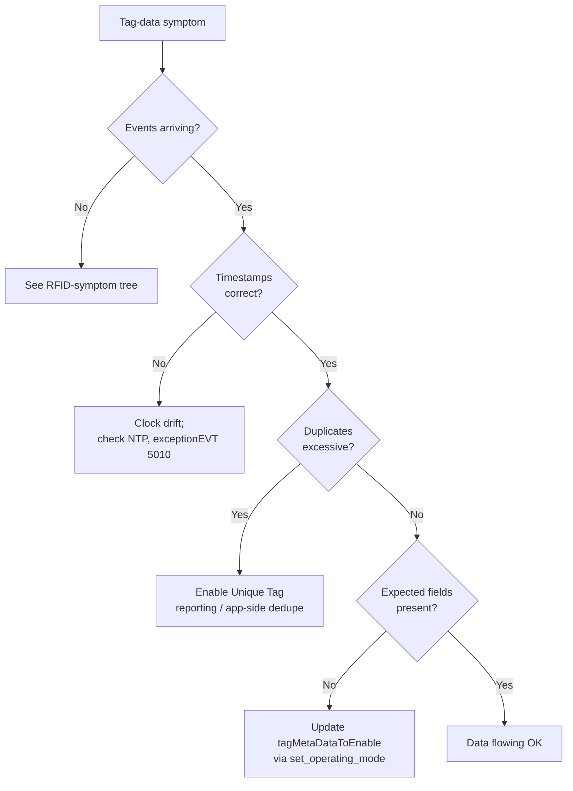

> 📙 **HOW-TO** · Audience: All · Time: ~10 min per symptom

This guide shows you how to troubleshoot tag-data anomalies on handheld readers.

#### Symptom: no tag data events received

- Verify subscription topic matches the configured channel (`data1event` vs `data2event`).
- Verify the wildcard pattern includes the right serial number.
- Verify the reader is actually running an operation — [`get_status`](https://aa5123.github.io/RFID-40-90-handled-reader-api-reference-documentatiion/#op-get-status) should show `operating_state: running`.

#### Symptom: events arrive but payloads are empty or partial

- Check the operating mode — `inventory` mode does not include RSSI even if your application expects it.
- Check the verbosity setting in [`config_events`](https://aa5123.github.io/RFID-40-90-handled-reader-api-reference-documentatiion/#op-config-events) — compact mode omits default-value fields.

#### Symptom: duplicate tag reads

- Expected behaviour for raw (non-coalesced) reporting.
- Application should deduplicate per [Process tag data](/rfid/tag-data/process).

#### Symptom: timestamp drift

- The reader's clock has drifted beyond NTP correction range; check `exceptionEVT` for code `5010 clock_drift_detected`.
- Reboot to force NTP sync.

**Related:** 📙 [Configure Events](/observability/events/configure) · 📕 [dataEVT Schema](/rfid/tag-data/dataevt-schema) · 📙 [Processing Tag Data](/rfid/tag-data/process) · 📘 [QoS Levels](/foundations/mqtt/qos)
