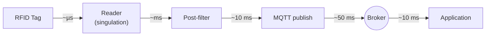
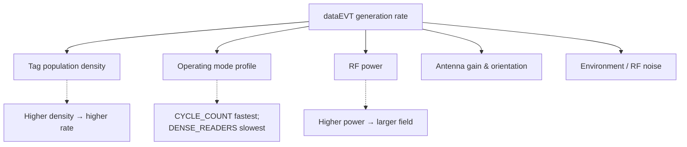

> 📘 **EXPLANATION** · Audience: All · Read time: ~6 min

Tag data flows from the antenna to the application through five stages. Knowing the path is the foundation for capacity planning, latency budgeting, and deduplication strategy.

### The flow

```
RF antenna → Reader firmware (singulation) → Post-filter → MQTT publish → Broker → Application subscriber
```

Each stage has its own latency and back-pressure characteristics. The total path budget from "tag energised" to "application receives event" is typically 50–500 ms depending on broker proximity.



### Event generation rate

The rate at which `dataEVT` events are emitted depends on:

- **Tag population density**, more tags in the field generate more events.
- **Operating mode**: higher-information modes are slower per tag (see [§9.1](/rfid/operating-mode/profiles)).
- **RF power**: affects effective read range and therefore tag count in the field.
- **Post-filters**: filtered-out tags do not generate events.

Typical event rates: 100–700 events/second for active inventory in a moderate-density environment.



### Deduplication considerations

`dataEVT` events are emitted per **read**, not per **tag**. The same tag in the field can be read multiple times per second. Whether the application sees duplicates depends on configuration: the reader can emit one event per read (raw, high-volume) or coalesce reads of the same EPC within a configurable window (deduplicated, lower-volume).

Applications that consume the raw stream must deduplicate themselves; applications that consume the coalesced stream can usually treat each event as a distinct sighting.

### Why two channels


A reader can be configured to publish tag data on one of two topic channels (`data1event`, `data2event`). The motivation and configuration are covered in [§10.4](/rfid/tag-data/dual-channels).

### QoS choices

Tag data defaults to QoS 0, at most once. For high-volume applications, QoS 0 is the default: losing a single read out of hundreds is operationally invisible, while QoS 1's PUBACK overhead becomes significant. Applications requiring guaranteed delivery can configure QoS 1; the trade-off is detailed in [§3.3](/foundations/mqtt/qos).

**Related:** 📘 [§3.3 QoS Levels](/foundations/mqtt/qos) · 📘 [§10.4 Dual Data Channels](/rfid/tag-data/dual-channels) · 📕 [§16.4 DATA Interface](#chapter-16--mqtt-api-reference) · 📕 [§10.2 dataEVT Schema](/rfid/tag-data/dataevt-schema)
