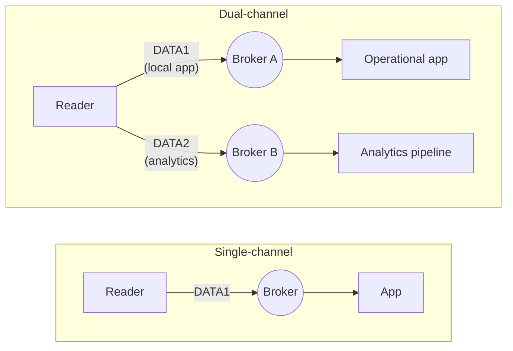

> 📘 **EXPLANATION** · Audience: Solution Builder · Read time: ~4 min

IOTC exposes two tag-data channels: `data1event` and `data2event`. They are independent topic families carrying the same `dataEVT` payload schema. A reader is configured to publish on one channel; configuration is per-reader, not per-tag.

### Why two channels exist

Three motivations:

- **Load balancing across consumers.** Two consumer applications can each subscribe to a different channel and receive disjoint subsets of the fleet's tag-data stream.
- **Priority separation.** Operationally critical readers can publish on `data1event` with a low-latency consumer; background-volume readers can publish on `data2event` with a batch consumer.
- **Topology specialisation.** Different channels can route to different brokers (see [§8.4](/infrastructure/endpoints/multi-endpoint)), enabling architectures where high-value data goes to one pipeline and high-volume data to another.

### How channel assignment is configured

Channel assignment is set via [`config_events`](https://aa5123.github.io/RFID-40-90-handled-reader-api-reference-documentatiion/#op-config-events) (see [§11.3](/observability/events/configure)). A reader publishes all its tag data on the configured channel; the assignment is sticky across reboots.

### What this implies for application architecture

Applications must subscribe to **the channel the reader is configured to use**. Subscribing to `data1event` when readers are configured for `data2event` results in no data. Fleet-wide dashboards typically subscribe to **both** channels using wildcard topics; per-channel specialised consumers subscribe to one.

**Related:** 📘 [§10.1 Tag Data Architecture](/rfid/tag-data/architecture) · 📙 [§11.3 Configure Event Reporting](/observability/events/configure) · 📕 [§16.4 DATA Interface](#chapter-16--mqtt-api-reference) · 📕 [§16.2 config_events](#chapter-16--mqtt-api-reference)
